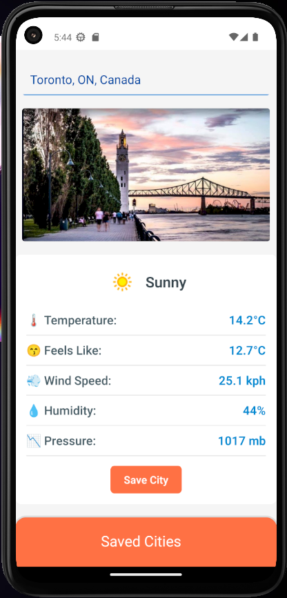
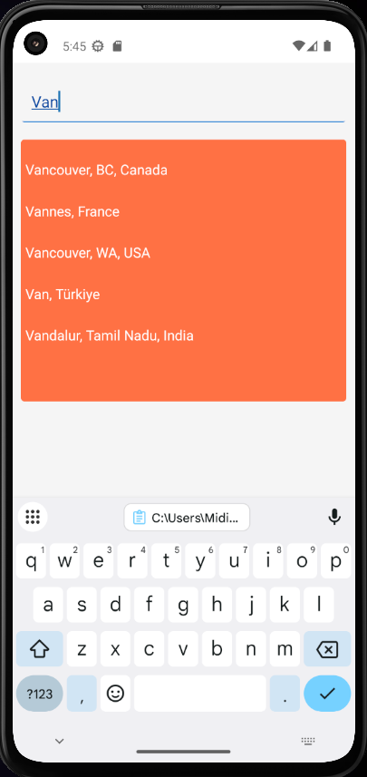
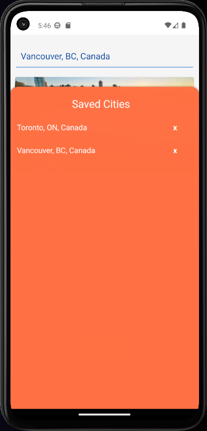

<h1 align="center">Expo Weather App</h1>
<p align="center"><strong>Demo Weather App using Expo + React Native</strong>
</p>
<div align="center">



</div>

<p align="center">
  
  


</p>

<p align="center">
  <a href="#introduction">Introduction</a> · 
  <a href="#installation">Installation</a> ·
  <a href="#license">License</a> 
</p>

## Introduction

A modern weather app that displays real-time weather information along with dynamic city images using the Google Maps API. Includes a personalized, persistent list of saved cities for quick access and tracking.

## Installation

This project requires **Node.js** installed on your machine.

### 🧩 Step-by-Step Setup

1.  **Clone the repository**  
    Follow [GitHub's cloning instructions](https://docs.github.com/en/repositories/creating-and-managing-repositories/cloning-a-repository) or run:
    ```bash
    git clone https://github.com/Nicolas-Arias3142/WeatherApp.git
    cd WeatherApp
    ```
2.  **Install dependencies**
    ```bash
    npm install
    ```
3.  **Set up your `.env` file**

    Get [Places API](https://developers.google.com/maps/documentation/places/web-service/overview) Key from Google and get [Weather Api](https://www.weatherapi.com)

    Copy `.env.example` and rename it to .env

    In the `.env` file, set the following values:

    ```bash
      EXPO_PUBLIC_API_WEATHER_KEY="Your weather api key"
      EXPO_PUBLIC_API_PLACES_KEY="Your places api key"
    ```

4.  **Start the app dev mode**
    ```bash
    npm run start
    ```

## License

This application is licensed under the [MIT license](https://github.com/Nicolas-Arias3142/WeatherApp/blob/main/LICENSE).
